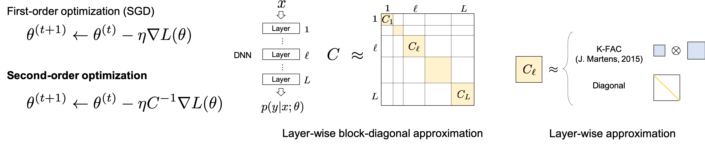

# PyTorch-SSO (alpha release)

Scalable Second-Order methods in PyTorch.

- Open-source library for second-order optimization and Bayesian inference.

- An earlier iteration of this library ([chainerkfac](https://github.com/tyohei/chainerkfac)) holds the world record for large-batch training of ResNet-50 on ImageNet by [Kronecker-Factored Approximate Curvature (K-FAC)](https://arxiv.org/abs/1503.05671), scaling to batch sizes of 131K.
  - Kazuki Osawa et al, “Large-Scale Distributed Second-Order Optimization Using Kronecker-Factored Approximate Curvature for Deep Convolutional Neural Networks”, **IEEE/CVF CVPR 2019**.
  - [[paper](http://openaccess.thecvf.com/content_CVPR_2019/html/Osawa_Large-Scale_Distributed_Second-Order_Optimization_Using_Kronecker-Factored_Approximate_Curvature_for_Deep_CVPR_2019_paper.html)] [[poster](https://kazukiosawa.github.io/cvpr19_poster.pdf)]
- This library is basis for the Natural Gradient for Bayesian inference (Variational Inference) on ImageNet. 
  - Kazuki Osawa et al, “Practical Deep Learning with Bayesian Principles”, **NeurIPS 2019**.
  - [[paper (preprint)](https://arxiv.org/abs/1906.02506)]

## Scalable Second-Order Optimization


### Optimizers

PyTorch-SSO provides the following optimizers.

- Second-Order Optimization
  - `torchsso.optim.SecondOrderOptimizer` [[source](https://github.com/cybertronai/pytorch-sso/blob/master/torchsso/optim/secondorder.py)]
  - updates the parameters with the gradients pre-conditioned by the curvature of the loss function (`torch.nn.functional.cross_entropy`) for each `param_group`.
- Variational Inference (VI)
  - `torchsso.optim.VIOptimizer` [[source](https://github.com/cybertronai/pytorch-sso/blob/master/torchsso/optim/vi.py)]
  - updates the posterior distribution (mean, covariance) of the parameters by using the curvature for each `param_group`.

### Curvatures

You can specify a type of the information matrix to be used as the curvature from the following.

- Hessian [WIP]

- Fisher information matrix

- Covariance matrix (empirical Fisher)

  

Refer [Information matrices and generalization](https://arxiv.org/abs/1906.07774) by Valentin Thomas et al. (2019) for the definitions and the properties of these information matrices.


Refer Section 6 of [Optimization Methods for Large-Scale Machine Learning](https://arxiv.org/abs/1606.04838) by L´eon Bottou et al. (2018) for a clear explanation of the second-order optimzation using these matrices as curvature.

### Approximation Methods

PyTorch-SSO calculates the curvature as a layer-wise block-diagonal matrix. 

You can specify the approximation method for the curvatures in each layer from the follwing.

1. Full (No approximation)
2. Diagonal approximation
3. [Kronecker-Factored Approximate Curvature (K-FAC)](https://arxiv.org/abs/1503.05671)

PyTorch-SSO currently supports the following layers (Modules) in PyTorch:

| Layer (Module)            | Full               | Diagonal           | K-FAC              |
| ------------------------- | ------------------ | ------------------ | ------------------ |
| `torch.nn.Linear`         | :heavy_check_mark: | :heavy_check_mark: | :heavy_check_mark: |
| `torch.nn.Conv2d`         | -                  | :heavy_check_mark: | :heavy_check_mark: |
| `torch.nn.BatchNorm1d/2d` | -                  | :heavy_check_mark: | -                  |

To apply PyTorch-SSO, 
- Set`requires_grad` to `True` for each Module.
- The network you define cannot contain any other modules.
- E.g., You need to use `torch.nn.functional.relu/max_pool2d` instead of `torch.nn.ReLU/MaxPool2d` to define a ConvNet.

### Distributed Training

PyTorch-SSO supports *data parallelism* and *MC samples parallelism* (for VI)
for distributed training among multiple processes (GPUs).

## Installation
To build PyTorch-SSO run (on a Python 3 environment)
```bash
git clone git@github.com:cybertronai/pytorch-sso.git
cd pytorch-sso
python setup.py install
```

To use the library
```python
import torchsso
```

### Additional requirements

PyTorch-SSO depends on [CuPy](https://cupy.chainer.org/) for fast GPU computation and [ChainerMN](https://github.com/chainer/chainermn) for communication. To use GPUs, you need to install the following requirements **before the installation of PyTorch-SSO**. 

| Running environment | Requirements           |
| ------------------- | ---------------------- |
| single GPU          | CuPy                   |
| multiple GPUs       | Cupy with NCCL, MPI4py |

Refer [CuPy installation guide](https://docs-cupy.chainer.org/en/stable/install.html) and [ChainerMN installation guide](https://docs.chainer.org/en/stable/chainermn/installation/guide.html#chainermn-installation) for details.

## Examples

- [Image classification with a single process](https://github.com/cybertronai/pytorch-sso/tree/master/examples/classification) (MNIST, CIFAR-10)
- [Image classification with multiple processes](https://github.com/cybertronai/pytorch-sso/tree/master/examples/distributed/classification) (CIFAR-10/100, ImageNet)

## Authors

Kazuki Osawa ([@kazukiosawa](https://github.com/kazukiosawa)) and Yaroslav Bulatov ([@yaroslavvb](https://github.com/yaroslavvb))
